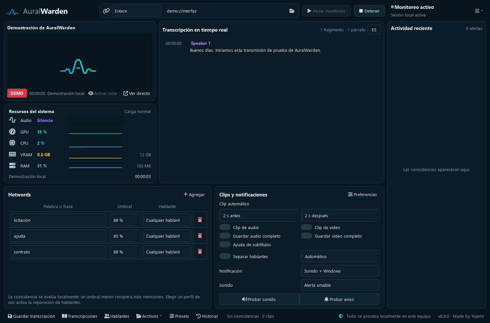
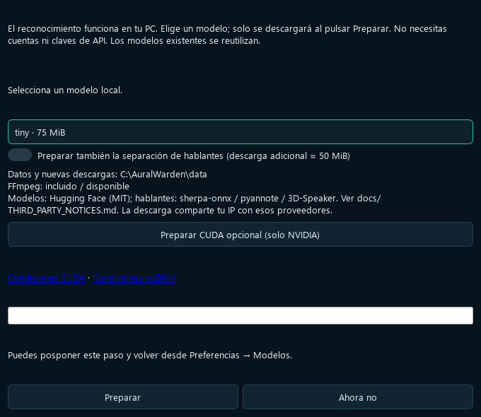
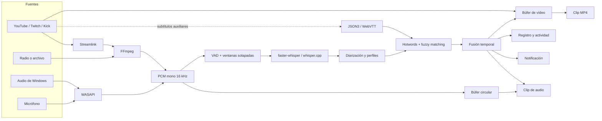

<div align="center">
  
  <h1>AuralWarden</h1>
  <p><strong>Escucha el directo. Detecta lo importante. Guarda solo la evidencia que necesitas.</strong></p>
  <p>
    Monitor local para Windows con transcripción en vivo, alertas por palabras clave,<br>
    clips automáticos, separación de hablantes y adaptación al rendimiento del equipo.
  </p>

  <p>
    
    
    
    
    
    
    <a href="https://github.com/Yojemr/AuralWarden/actions/workflows/tests.yml"></a>
    <a href="https://github.com/Yojemr/AuralWarden/actions/workflows/codeql.yml"></a>
  </p>

  <p>
    <a href="#inicio-rápido">Inicio rápido</a> ·
    <a href="#funciones">Funciones</a> ·
    <a href="#cómo-funciona">Arquitectura</a> ·
    <a href="docs/GUI.md">Manual</a> ·
    <a href="CHANGELOG.md">Cambios</a>
  </p>
</div>

> [!IMPORTANT]
> **AuralWarden 1.0.2 incorpora las correcciones de la auditoría y está en validación local.** Antes de publicar binarios resta completar la correspondencia de fuentes de sus bibliotecas nativas. El portable CPU y los componentes opcionales se validan por separado. Las compilaciones iniciales no están firmadas digitalmente: descárgalas únicamente del perfil oficial de [Yojemr](https://github.com/Yojemr) y comprueba el SHA-256 publicado.



## ¿Qué es AuralWarden?

AuralWarden es una aplicación de escritorio que permanece pendiente de una transmisión, del audio general de Windows o de un micrófono. Convierte la voz a texto mediante modelos Whisper ejecutados en el propio equipo y avisa cuando encuentra una palabra o frase configurada.

Su objetivo no es obligar a grabarlo todo. Por defecto mantiene una transcripción temporal y un búfer corto en memoria. Cuando ocurre algo importante puede notificar, recuperar los segundos anteriores y posteriores y crear un clip de audio o vídeo con contexto.

| Local primero | Alertas con contexto | Diseñada para sesiones largas |
|---|---|---|
| El reconocimiento, las hotwords, la diarización y los perfiles de voz se procesan en el PC. | Una detección puede producir sonido, aviso de Windows, registro y clip sincronizado. | Reconexión, bandeja del sistema, recuperación de sesión y ajuste dinámico de recursos. |

### Casos de uso

- Seguir directos extensos sin mantener la ventana o el navegador abiertos.
- Detectar nombres, temas, anuncios, llamados o frases importantes.
- Tomar notas de reuniones, clases, conferencias o audio reproducido en Windows.
- Obtener clips breves alrededor de una mención sin guardar horas completas de vídeo.
- Crear una transcripción con hablantes y revisar después el momento exacto de cada frase.
- Automatizar el inicio, la consulta de estado y la lectura reciente desde un agente local.

## Contenido

- [Inicio rápido](#inicio-rápido)
- [Funciones](#funciones)
- [Fuentes compatibles](#fuentes-compatibles)
- [Qué se guarda](#qué-se-guarda)
- [Modelos y hardware](#modelos-y-hardware)
- [Cómo funciona](#cómo-funciona)
- [Control local para agentes](#control-local-para-agentes)
- [Privacidad y seguridad](#privacidad-y-seguridad)
- [Estructura del proyecto](#estructura-del-proyecto)
- [Desarrollo y pruebas](#desarrollo-y-pruebas)
- [Estado del proyecto](#estado-del-proyecto)
- [Preguntas frecuentes](#preguntas-frecuentes)
- [Licencia, autoría y referencias](#licencia-autoría-y-referencias)

## Inicio rápido

### Usar la carpeta portable

La versión pública está diseñada para funcionar sin instalar Python:

1. Descarga la carpeta publicada en [Releases](https://github.com/Yojemr/AuralWarden/releases) y extráela completa.
2. Ejecuta `AuralWarden.exe` sin mover por separado las carpetas `runtime` o `docs`.
3. En **Preparar AuralWarden**, revisa la recomendación y descarga un modelo.
4. Elige **Enlace**, **Audio del sistema** o **Micrófono**.
5. Agrega una o más hotwords, ajusta las opciones de clips y pulsa **Iniciar monitoreo**.

El asistente crea la estructura de datos, muestra el tamaño de cada modelo y verifica cada archivo antes de activarlo. Una descarga incompleta o alterada no reemplaza un modelo válido.



> [!NOTE]
> Los modelos no están incluidos dentro del repositorio ni del portable. Se descargan una sola vez y quedan en `data/models`. Las compilaciones iniciales no estarán firmadas digitalmente, por lo que Windows puede mostrar “editor desconocido”; comprueba siempre el origen oficial y el SHA-256 publicado con cada versión.

### Ejecutar desde el código fuente

Requisitos: Windows 10/11 de 64 bits, Python 3.12 y PowerShell.

```powershell
git clone https://github.com/Yojemr/AuralWarden.git
cd AuralWarden
.\scripts\setup.ps1 -Profile public
.\scripts\run-gui.ps1
```

El perfil `public` prepara captura, interfaz, transcripción CPU, diarización y pruebas. No instala CUDA.

## Funciones

### Transcripción y detección

- Transcripción local continua con `faster-whisper` y respaldo modular mediante `whisper.cpp`.
- Ventanas solapadas, VAD y probabilidades por palabra para reducir silencios y pérdidas entre fragmentos.
- Hotwords exactas o difusas con umbral individual.
- Detección de frases aunque sus palabras aparezcan en dos fragmentos consecutivos.
- Actualización inmediata al agregar, editar, activar o eliminar una hotword durante la sesión.
- Segunda pasada de mayor precisión ante coincidencias dudosas o audio omitido por VAD.
- Contexto y vocabulario opcionales para nombres o términos propios.
- Fusión temporal que evita repetir una alerta detectada por varias fuentes.

### Hablantes y perfiles de voz

- Diarización local para separar turnos como `Speaker 1`, `Speaker 2`, etc.
- Número esperado de participantes configurable para reducir hablantes inexistentes.
- Nombres manuales limitados a la sesión actual.
- Perfiles voluntarios que conservan una huella numérica local, no la muestra de inscripción.
- Hotwords restringibles a un perfil: solo alertan y crean clips cuando la frase se atribuye a esa voz.

> [!CAUTION]
> La diarización y los perfiles son estimaciones probabilísticas. No deben utilizarse como autenticación biométrica, prueba de identidad ni base única para decisiones importantes.

### Alertas y evidencia

- Notificaciones de Windows y tres sonidos integrados realmente diferentes.
- Botones para probar el sonido o la notificación completa antes de monitorear.
- Clips WAV y MP4 con segundos configurables antes y después de la mención.
- Vídeo de 720p priorizado para equilibrar legibilidad, red y espacio.
- Grabación completa de audio o vídeo como opciones independientes.
- Nombres legibles con fecha, tipo, hotword y momento del directo.
- Historial local de hasta 1.000 alertas con búsqueda y acceso a la evidencia existente.

### Directos, subtítulos y continuidad

- Resolución automática de enlaces mediante Streamlink con respaldo de FFmpeg.
- Subtítulos de YouTube como segunda fuente auxiliar, sin sustituir la transcripción local.
- Pistas JSON3 y WebVTT segmentadas sobre M3U8, incluso cuando YouTube identifica mal el idioma de una única pista automática.
- Reintento de subtítulos que aparecen tarde y renovación de enlaces temporales.
- Espera cuando el directo aún no comienza y reconexión progresiva ante cortes recuperables.
- Estados diferenciados para espera, monitoreo, reconexión, finalización y cancelación.

### Interfaz y rendimiento

- Panel principal con transcripción, hablantes, tiempos, actividad y configuración visible.
- Previsualización desactivada inicialmente para ahorrar recursos; los clips no dependen de ella.
- Historial breve de CPU, GPU, RAM y VRAM.
- Ajuste automático con histéresis: reduce tareas secundarias bajo carga y se recupera gradualmente.
- Modos **Automático**, **Precisión máxima**, **Equilibrado** y **Bajo consumo**.
- Ejecución minimizada en la bandeja sin detener alertas ni clips.
- Biblioteca para leer TXT, JSON y diarios recuperados como texto legible dentro de la aplicación.
- Párrafos compactos con hora inicial; el intervalo exacto aparece al pasar el cursor o hacer clic.

## Fuentes compatibles

| Fuente | Cómo se obtiene | Observaciones |
|---|---|---|
| YouTube Live | Streamlink + FFmpeg | Admite subtítulos auxiliares cuando YouTube expone una pista compatible. |
| Twitch | Streamlink | No integra chat, cuenta ni credenciales. |
| Kick | Streamlink | Algunas emisiones pueden estar sujetas a comprobaciones de la propia plataforma. |
| Radio y flujos directos | Streamlink o FFmpeg | HLS, DASH, MP3, AAC, Ogg y otros formatos reconocidos por las herramientas. |
| Archivo local | FFmpeg | Audio o vídeo elegido por el usuario. |
| Audio general de Windows | WASAPI loopback | Captura todo lo reproducido por el dispositivo seleccionado. |
| Micrófono | WASAPI / PyAudioWPatch | Depende de permisos y del modo de acceso del dispositivo. |

AuralWarden trabaja con transmisiones públicas y enlaces directos. No intenta eludir autenticación, DRM, restricciones geográficas ni condiciones de las plataformas.

## Qué se guarda

Las opciones son independientes; no existen dos modos rígidos de “grabar” o “no grabar”.

| Elemento | Comportamiento predeterminado | Cuándo permanece |
|---|---|---|
| Transcripción visible | Temporal | Al pulsar **Guardar transcripción**, activar guardado o recuperar un cierre inesperado. |
| Diario de recuperación | Temporal durante la sesión | Se elimina tras un cierre normal; se ofrece restaurarlo después de una interrupción. |
| Historial de alertas | Local y acotado | Cuando se produce una coincidencia. |
| Clip de audio | Desactivado | Cuando se activa el interruptor y ocurre una coincidencia. |
| Clip de vídeo | Desactivado | Cuando la fuente tiene vídeo, se activa el interruptor y ocurre una coincidencia. |
| Audio completo | Desactivado | Únicamente si el usuario lo activa. |
| Vídeo completo | Desactivado | Únicamente si el usuario lo activa; puede ocupar varios gigabytes. |

El búfer circular conserva solo la ventana reciente necesaria para recuperar el contexto anterior a una hotword.

## Modelos y hardware

El asistente analiza CPU, RAM, GPU y VRAM localmente. Solo recomienda modelos compatibles que puedan instalarse en la carpeta de datos.

| Modelo | Descarga aproximada | Uso recomendado |
|---|---:|---|
| Tiny | 75 MiB | Equipos modestos, menor latencia o pruebas rápidas. |
| Base | 141 MiB | Punto de partida del portable CPU. |
| Small | 464 MiB | Mayor precisión con un coste moderado. |
| Large-v3-turbo | 1,51 GiB | Priorizar precisión; recomendable con CPU potente o CUDA. |

### Aceleración

- **CPU:** incluida en el paquete público y utilizada con `int8`.
- **NVIDIA:** CUDA/cuBLAS se descarga aparte, requiere aceptación de sus condiciones y ocupa aproximadamente 546 MiB adicionales. AuralWarden no instala ni cambia controladores.
- **AMD o Intel:** puede configurarse un ejecutable externo de `whisper.cpp` compilado con Vulkan y su modelo GGML/GGUF. El binario Vulkan no está incluido actualmente.

La selección automática favorece `large-v3-turbo` con una GPU NVIDIA compatible y al menos 6 GB de VRAM. Con menos memoria o solo CPU elige progresivamente Small, Base o Tiny. La velocidad real depende del modelo, el audio, las opciones activas y la carga simultánea del equipo.

Más información: [compatibilidad de hardware](docs/HARDWARE.md) y [primer inicio](docs/FIRST_RUN.md).

## Cómo funciona



### Capas principales

| Capa | Responsabilidad |
|---|---|
| Captura | Resolver fuentes, convertir audio, mantener el reloj y reconectar. |
| Reconocimiento | Elegir motor/modelo, aplicar VAD, transcribir y repetir candidatos dudosos. |
| Hablantes | Extraer huellas, agrupar voces y comparar perfiles voluntarios. |
| Detección | Normalizar texto, evaluar umbrales y fusionar coincidencias repetidas. |
| Evidencia | Mantener búferes acotados y producir WAV, MP4 o grabaciones completas. |
| Persistencia | Guardar preferencias, historial, sesiones y recuperación mediante escrituras atómicas. |
| Interfaz | Presentar estado y recibir acciones sin contener la lógica del motor. |
| Control local | Exponer acciones limitadas a procesos de la misma cuenta cuando el usuario lo habilita. |

El backend no depende de PySide6. La interfaz consume eventos del motor y puede cerrarse visualmente mientras el proceso continúa en la bandeja.

Consulta la [arquitectura ampliada](docs/ARCHITECTURE.md) y la [documentación del backend](docs/BACKEND.md).

## Control local para agentes

AuralWarden incluye un protocolo opcional para que Codex, otra IA o un script local pueda manejar las acciones habituales sin utilizar el mouse.

- Está desactivado de forma predeterminada.
- No abre puertos ni ofrece una API web.
- No utiliza claves de OpenAI ni de otro proveedor.
- Crea una credencial aleatoria local que nunca debe copiarse a prompts o al repositorio.
- Solo permite consultar capacidades/estado, configurar el enlace y las hotwords, iniciar/detener, leer resultados recientes y mostrar la ventana.
- No permite ejecutar comandos, elegir archivos ni leer configuraciones privadas.

Ejemplo de solicitud:

```json
{
  "action": "set_hotwords",
  "hotwords": [
    {"phrase": "palabra clave", "threshold": 90}
  ]
}
```

```powershell
.\AuralWarden-Control.ps1 `
  -Request .\solicitud.json `
  -Output .\respuesta.json
```

Consulta el [protocolo completo](docs/AGENT_CONTROL.md) y su [esquema JSON](docs/agent-control.schema.json).

## Privacidad y seguridad

AuralWarden está diseñado para que la voz procesada no dependa de una API de transcripción.

| Acción | ¿Necesita red? | ¿Qué sale del equipo? |
|---|---|---|
| Transcribir, detectar y diarizar | No | Nada enviado por AuralWarden a un servicio de IA. |
| Monitorizar un enlace | Sí | Solicitudes normales necesarias para obtener esa transmisión y sus metadatos. |
| Consultar subtítulos de YouTube | Sí | Solicitudes para localizar y leer la pista pública. |
| Descargar modelos o CUDA | Sí | Solicitud HTTPS al proveedor correspondiente; el proveedor puede observar la IP. |
| Audio del sistema, micrófono o archivo | No | El contenido permanece local. |
| Control para agentes | No | Comunicación local entre procesos de la misma cuenta de Windows. |

Medidas incluidas:

- Descargas fijadas por repositorio, revisión, nombre, tamaño y SHA-256.
- Publicación atómica: un modelo incompleto nunca aparece como instalado.
- Extracción de componentes mediante una lista cerrada, sin `extractall` ni rutas libres.
- Subprocesos ejecutados con listas de argumentos, no mediante cadenas de shell.
- Títulos y subtítulos remotos renderizados siempre como texto plano.
- URL privadas redactadas en las respuestas del control local.
- Datos, modelos, cookies, archivos `.env`, sesiones y evidencias excluidos de Git.
- Política de reporte responsable en [SECURITY.md](SECURITY.md).

La auditoría previa a 0.9.0 encontró un riesgo medio en la presentación de texto remoto; fue corregido y quedó cubierto por una prueba de regresión. Esto no convierte la aplicación ni sus dependencias en infalibles. Revisa la [política de privacidad](docs/PRIVACY.md) antes de monitorizar información sensible.

> [!WARNING]
> El usuario es responsable de obtener las autorizaciones necesarias para grabar, transcribir o conservar comunicaciones y de cumplir las normas aplicables y las condiciones de cada plataforma.

## Estructura del proyecto

```text
AuralWarden/
├── .github/                  # Pruebas, seguridad y plantillas de colaboración
├── src/auralwarden/          # Código del motor, la interfaz y los adaptadores
│   ├── backends/             # Backend de demostración y contratos
│   ├── diarization/          # Separación de hablantes
│   ├── transcribers/         # faster-whisper y whisper.cpp
│   └── ui/                   # Aplicación Qt y recursos visuales
├── tests/                    # Pruebas automatizadas
├── scripts/                  # Preparación, ejecución, control y empaquetado
├── docs/                     # Manuales, arquitectura, privacidad y referencias
├── CHANGELOG.md              # Historial semántico de versiones
├── CONTRIBUTING.md           # Guía de contribución
├── SECURITY.md               # Reporte de vulnerabilidades
├── NOTICE                    # Autoría y atribuciones generales
├── LICENSE                   # GPL-3.0-only
└── pyproject.toml            # Metadatos y dependencias opcionales
```

Después del primer inicio, los datos quedan fuera del código:

```text
data/
├── models/                   # Modelos Whisper y diarización
├── runtime/components/       # CUDA o motores opcionales verificados
├── sessions/                 # Metadatos y recuperación
├── transcripts/              # Exportaciones elegidas
├── clips/audio/              # Clips WAV
├── clips/video/              # Clips MP4
└── recordings/               # Grabaciones completas opcionales
```

En modo instalado se utiliza `%LOCALAPPDATA%\AuralWarden`. En modo portable, indicado por `portable.flag`, se utiliza `data/` junto al ejecutable.

## Desarrollo y pruebas

### Perfiles del entorno

```powershell
# Núcleo y pruebas
.\scripts\setup.ps1 -Profile core

# Distribución pública CPU completa
.\scripts\setup.ps1 -Profile public

# Desarrollo completo con CUDA en el entorno local
.\scripts\setup.ps1 -Profile all
```

También existen los perfiles `capture`, `stt`, `cuda`, `diarization` y `ui` para trabajar en una capa concreta.

### Diagnóstico, demostración y pruebas

```powershell
.\scripts\run.ps1 doctor
.\scripts\run.ps1 simulate
.\scripts\run-gui.ps1 -Demo
.\scripts\test.ps1
```

La simulación es local, no descarga modelos y genera eventos y clips WAV verificables. Las dependencias exactas utilizadas para la construcción pública quedan registradas en `requirements-build.lock.txt`.

Antes del primer commit o de una publicación, ejecuta la revisión pública completa:

```powershell
.\scripts\check-publication.ps1 -RunTests
```

La revisión enumera exactamente los archivos no ignorados por Git, comprueba versiones, tamaños y posibles credenciales o rutas personales sin mostrar el contenido sensible encontrado.

Dependabot revisa mensualmente las dependencias y, si encuentra cambios menores o correcciones, abre una propuesta para revisión. No modifica `main`, no fusiona cambios y no crea versiones de AuralWarden automáticamente.

### Construir el portable CPU

```powershell
.\scripts\build-portable.ps1 `
  -WithCapture `
  -WithStt `
  -WithDiarization `
  -WithUi `
  -BundleFfmpeg `
  -VersionedFolder
```

El resultado queda en `outputs/AuralWarden-<versión>` como carpeta ejecutable, no como ZIP. El constructor conserva como máximo dos versiones anteriores que no estén activas ni contengan datos locales.

Para conservar todas las carpetas anteriores durante una validación, añade `-PreservePreviousVersions`. La instalación desde fuente utiliza las versiones fijadas en `requirements-build.lock.txt`.

## Estado del proyecto

### Versión 1.0.2

- [x] Fuentes web, archivos, audio de Windows y micrófono.
- [x] Transcripción local, VAD, segunda pasada y hotwords entre fragmentos.
- [x] Clips de audio/vídeo y grabación completa opcional.
- [x] Subtítulos auxiliares de YouTube con reintento y renovación.
- [x] Diarización conservadora, nombres y perfiles de voz voluntarios.
- [x] Interfaz, bandeja, historial, recuperación y reconexión.
- [x] Control local limitado para agentes y automatizaciones.
- [x] Instalador de modelos con integridad y CUDA separado.
- [x] Constructor portable CPU con CUDA opcional separado.
- [x] 203 pruebas automatizadas y revisión independiente de las correcciones sensibles.
- [x] Pruebas de GitHub Actions, CodeQL, Dependabot y plantillas de colaboración preparados.

### Validación de la versión pública

- [x] Probar el portable desde una extracción nueva y aislada en Windows.
- [x] Comprobar descargas reales de modelos y CUDA opcional en el equipo de desarrollo.
- [x] Conservar las pruebas prolongadas realizadas con versiones candidatas del mismo núcleo.
- [ ] Completar las fuentes correspondientes de bibliotecas nativas y preparar el ZIP público 1.0.2 aprobado.
- [ ] Crear el repositorio remoto, revisar el primer commit y habilitar el reporte privado de vulnerabilidades.

No está disponible un segundo computador para una comprobación independiente. Las pruebas prolongadas de versiones anteriores no sustituyen una nueva sesión con voz real después de este parche.

Consulta el [roadmap](docs/ROADMAP.md) y el [historial de cambios](CHANGELOG.md).

## Preguntas frecuentes

<details>
<summary><strong>¿Necesito dejar YouTube o Twitch abierto en el navegador?</strong></summary>

No. AuralWarden obtiene la transmisión mediante Streamlink/FFmpeg. **Ver directo** abre el enlace únicamente cuando tú lo solicitas.
</details>

<details>
<summary><strong>¿La aplicación sigue funcionando al minimizarla?</strong></summary>

Sí. Mientras el proceso permanezca en la bandeja, continúa transcribiendo, detectando y creando clips. Elegir **Salir** o finalizar el proceso detiene el monitoreo.
</details>

<details>
<summary><strong>¿Los subtítulos de YouTube reemplazan a Whisper?</strong></summary>

No. Son una fuente auxiliar para recuperar detecciones. Se muestran aparte y no se mezclan con la transcripción principal.
</details>

<details>
<summary><strong>¿AuralWarden graba todo?</strong></summary>

No. Las grabaciones completas y los clips están desactivados inicialmente. La transcripción puede permanecer temporal y guardarse solo cuando el usuario lo decida.
</details>

<details>
<summary><strong>¿Necesito una API o una cuenta de IA?</strong></summary>

No. El STT, las hotwords, la diarización y los perfiles se ejecutan localmente. Solo se necesita Internet para fuentes remotas y para descargar inicialmente modelos o componentes.
</details>

<details>
<summary><strong>¿Por qué puede aparecer un hablante incorrecto?</strong></summary>

Ruido, música, solapamiento, fragmentos breves y cambios de micrófono pueden separar una misma voz o unir voces diferentes. Indicar el número esperado de participantes y usar perfiles con muestras claras mejora la estabilidad, pero no garantiza identidad.
</details>

## Documentación

- [Primer inicio y actualización](docs/FIRST_RUN.md)
- [Uso completo de la interfaz](docs/GUI.md)
- [Arquitectura](docs/ARCHITECTURE.md)
- [Backend y eventos](docs/BACKEND.md)
- [Compatibilidad de hardware](docs/HARDWARE.md)
- [Control local para agentes](docs/AGENT_CONTROL.md)
- [Privacidad](docs/PRIVACY.md)
- [Seguridad](SECURITY.md)
- [Contribuciones](CONTRIBUTING.md)
- [Componentes y licencias de terceros](docs/THIRD_PARTY_NOTICES.md)
- [Lista de verificación para publicaciones](docs/RELEASE_CHECKLIST.md)
- [Notas de AuralWarden 1.0.2](docs/RELEASE_NOTES_1.0.2.md)
- [Guía de publicación inicial en GitHub](docs/GITHUB_PUBLISHING.md)
- [Historial de versiones](CHANGELOG.md)

## Licencia, autoría y referencias

### Autoría

AuralWarden es un proyecto personal creado y mantenido por [Yojemr](https://github.com/Yojemr), con asistencia de desarrollo de Codex de OpenAI.

El código propio se distribuye bajo **GNU GPL-3.0-only**. Consulta [LICENSE](LICENSE), [NOTICE](NOTICE) y los [avisos de terceros](docs/THIRD_PARTY_NOTICES.md). Cada biblioteca, modelo y ejecutable conserva sus propios términos.

AuralWarden no está afiliado, patrocinado ni aprobado por YouTube, Twitch, Kick, OpenAI, NVIDIA ni por los proyectos enumerados a continuación.

### Tecnologías utilizadas

- [OpenAI Whisper](https://github.com/openai/whisper) — familia de modelos de reconocimiento de voz.
- [faster-whisper](https://github.com/SYSTRAN/faster-whisper) y [CTranslate2](https://github.com/OpenNMT/CTranslate2) — inferencia principal optimizada.
- [Streamlink](https://github.com/streamlink/streamlink) — resolución de transmisiones públicas.
- [FFmpeg](https://ffmpeg.org/) — conversión, remuestreo y manejo audiovisual.
- [yt-dlp](https://github.com/yt-dlp/yt-dlp) — metadatos y pistas auxiliares compatibles.
- [RapidFuzz](https://github.com/rapidfuzz/RapidFuzz) — coincidencia difusa de texto.
- [sherpa-onnx](https://github.com/k2-fsa/sherpa-onnx) y [3D-Speaker](https://github.com/modelscope/3D-Speaker) — VAD, huellas y separación local de hablantes.
- [whisper.cpp](https://github.com/ggml-org/whisper.cpp) — backend externo opcional para CPU/Vulkan.
- [Qt for Python / PySide6](https://doc.qt.io/qtforpython-6/) y [QtAwesome](https://github.com/spyder-ide/qtawesome) — interfaz de escritorio.

### Proyectos revisados como referencia conceptual

Estos proyectos se consultaron para comparar enfoques de streaming, diarización, perfiles y experiencia de usuario; no forman parte de las dependencias directas de AuralWarden:

- [benpiper/live-transcription](https://github.com/benpiper/live-transcription)
- [Me-in-U/LiveDialogue-Translator](https://github.com/Me-in-U/LiveDialogue-Translator)
- [coloeso/whisperlivekit](https://github.com/coloeso/whisperlivekit)
- [KoljaB/WhoSpeaksLive](https://github.com/KoljaB/WhoSpeaksLive)
- [homelab-00/TranscriptionSuite](https://github.com/homelab-00/TranscriptionSuite)

---

<div align="center">
  <strong>Made by Yojemr</strong><br>
  <sub>Procesamiento local, evidencia bajo control del usuario.</sub>
</div>
